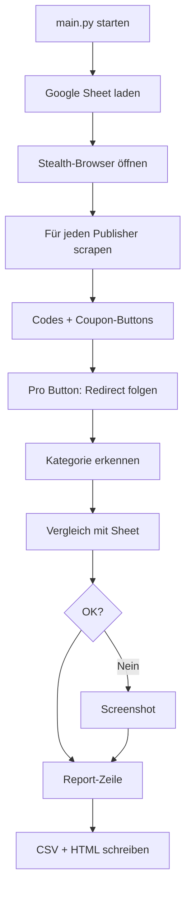

# Trendtours QC

Internes Qualitätssicherungs-Tool der **uppr GmbH** zur automatisierten Prüfung von Trendtours-Gutscheinlistings auf Affiliate-Publisher-Seiten.

Das Tool prüft die aktiven Top-Publisher monatlich: Gutscheincodes, Affiliate-Redirects, Logo und abgelaufene Aktionen (je nach Publisher-Profil). Referenzdaten kommen aus einem Google Sheet. Ergebnisse landen als Excel mit drei Blättern (Übersicht, Vollständig, Handlungsbedarf) plus CSV.

---

## Was wird geprüft?

| Prüfung | Beschreibung |
|--------|----------------|
| **Gutscheincode** | Seitenweit: aktueller Monatscode aus Sheet, keine veralteten Codes |
| **Affiliate-Links** | Buttons werden geklickt; Ziel-URL und Aktionscode in der URL werden mit dem Sheet abgeglichen |
| **Logo** | Trendtours-Logo auf der Seite (nicht bei allen Publishern) |
| **Abgelaufene Aktionen** | ShopClever: alte Codes ohne „abgelaufen“-Kennzeichnung |

**Publisher** stehen in `config/publishers.py` (11 URLs, 7 Gruppen — ohne durchgestrichene Partner aus der Vorgabe).

> **Hinweis:** ShopClever und coupons.de haben eigene Selektoren. Focus nutzt nur `data-testid="active-vouchers-widget"`. Andere Coupon-Seiten nutzen einen generischen Scraper. Cashback (Shoop, Igraal) prüft primär Codes und Logo.

---

## Voraussetzungen

- Python 3.9 oder höher
- Chromium (via Playwright)

---

## Installation

```bash
cd trendtours_QC
python3 -m venv venv
source venv/bin/activate   # Windows: venv\Scripts\activate
pip install -r requirements.txt
playwright install chromium
```

---

## Nutzung

```bash
source venv/bin/activate
python main.py
```

Die Konsole zeigt den Fortschritt pro Publisher und Button. Am Ende erscheinen Pfade zu den generierten Reports.

**Ausgabe:**

- `reports/QC_Report_YYYYMMDD_HHMMSS.xlsx` — Excel mit Blättern **Übersicht** (inkl. `Betroffene_Gutscheine` und Kurzfassung mit Gutscheintiteln), **Vollständig**, **Handlungsbedarf**
- `reports/QC_Report_YYYYMMDD_HHMMSS.csv` — gleiche Detaildaten wie Blatt „Vollständig“
- `reports/screenshots/` — pro Publisher ein **Übersichts-Screenshot** (alle Codes sichtbar) plus Fehler-Screenshots

---

## Google Sheet (Referenz / „Source of Truth“)

Das Sheet ist die **zentrale Monatsreferenz**: Welcher **Aktionscode** gilt gerade, und wohin muss welcher **Deal-Link** auf trendtours.de führen (Homepage, Flug, Bus, Reise-Hits, …). Das Tool lädt es per CSV-Export und vergleicht damit die Publisher-Seiten — ohne das Sheet müssten Codes und Ziel-URLs manuell gepflegt werden.

| Einstellung | Wert |
|-------------|------|
| **Sheet-ID** | `1QLWxjyjSu1el9tEjiBaT3wxSPcbkhVXEqybzE8Tk33Y` |
| **Export** | CSV über öffentlichen Export-Link (siehe `config/settings.py`) |
| **Spalten** | `Link`, `Aktions-Code` (erste Spalte = Kategoriename) |

**Kategorie-Mapping (intern → Sheet):**

| Interner Key | Name im Sheet |
|--------------|---------------|
| `homepage` | trendtours |
| `flugreisen` | Flugreise |
| `busreisen` | Busreise |
| `reise_hits` | Reise-Hits |
| `reisewelt` | Reisewelt |
| `reiseziele` | Reiseziele und Länder |

Das Sheet muss für den CSV-Export **lesbar** sein (z. B. „Jeder mit dem Link“). Bei `HTTP 401` läuft der QC mit Fallback weiter; Redirect-Vergleiche gegen das Sheet entfallen dann.

---

## Konfiguration

Alle Einstellungen in `config/settings.py` (Pydantic `BaseSettings`):

| Parameter | Standard | Bedeutung |
|-----------|----------|-----------|
| Publisher-Liste | `config/publishers.py` | Aktive Top-Publisher |
| `sheet_id` | siehe oben | Google-Sheet-Referenz |
| `headless` | `True` | Browser ohne GUI |
| `slow_mo` | `100` | Verzögerung zwischen Aktionen (ms) |
| `timeout` | `30000` | Playwright-Timeout (ms) |
| `report_dir` | `reports` | Report-Ausgabe |
| `screenshot_dir` | `reports/screenshots` | Fehler-Screenshots |

Browser simuliert ein **Android-Mobile-Gerät** (Viewport, User-Agent, Geolocation Berlin), um Bot-Detection zu reduzieren (`playwright-stealth`).

---

## Projektstruktur

```
trendtours_QC/
├── main.py                 # Einstieg: Orchestrierung des QC-Laufs
├── config/
│   ├── settings.py         # Zentrale Konfiguration
│   ├── sheet_loader.py     # Google-Sheet CSV laden
│   └── categories.py       # Kategorie-Erkennung aus Text
├── scraper/
│   ├── browser.py          # Stealth Playwright-Browser
│   ├── page_scraper.py     # Codes & Coupon-Buttons extrahieren
│   └── redirect_checker.py # Affiliate-Redirects auflösen
├── validators/
│   ├── coupon_validator.py # Code-Validierung (Fallback)
│   └── url_validator.py    # Redirect vs. Sheet
├── reporting/
│   └── report_generator.py # CSV + HTML
├── reports/                # Generierte Reports (nicht versionieren)
└── requirements.txt
```

---

## Ablauf (kurz)



---

## Entwicklung & Einzeltests

Module können isoliert getestet werden:

```bash
python scraper/browser.py      # Stealth-Test (bot.sannysoft.com)
python scraper/page_scraper.py # Scraping ShopClever
python scraper/redirect_checker.py
python validators/coupon_validator.py
```

---

## Bekannte Einschränkungen

- **Sheet nicht erreichbar:** Redirect-Checks ohne Referenz gelten als OK; Fehlermeldung in der Konsole.
- **coupons.de:** Anderes DOM — aktuell keine `coupon-listing-item`-Elemente; Erweiterung des Scrapers geplant.
- **Code-Validierung:** `validate_codes` warnt in der Konsole, fließt aber noch nicht in die Report-Spalten ein.
- **Abhängigkeiten:** `typer` und `httpx` in `requirements.txt` werden im Hauptcode noch nicht genutzt.

---

## Abhängigkeiten (Auszug)

- Playwright + playwright-stealth — Browser-Automation
- BeautifulSoup4 + lxml — HTML-Parsing
- pandas — Sheet & Reports
- pydantic-settings — Konfiguration
- rich — CLI-Ausgabe

---

## Urheber

**uppr GmbH** — internes Tool, nicht für externe Weitergabe bestimmt.
