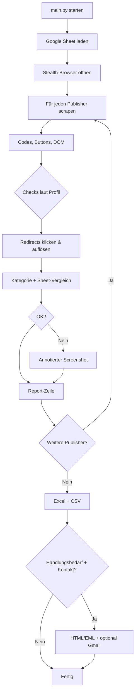

# Trendtours QC

Internes Qualitätssicherungs-Tool der **uppr GmbH** zur automatisierten Prüfung von Trendtours-Gutscheinlistings auf Affiliate-Publisher-Seiten.

Das Tool prüft die aktiven Top-Publisher monatlich: Gutscheincodes, Affiliate-Redirects, Logo und abgelaufene Aktionen — je nach Publisher-Profil. Referenzdaten kommen aus einem Google Sheet (ergänzt durch lokale Overrides). Ergebnisse landen als Excel mit drei Blättern (Übersicht, Vollständig, Handlungsbedarf), als CSV, mit Screenshots und optional fertigen E-Mail-Entwürfen an die Publisher-Kontakte.

---

## Was wird geprüft?

| Prüfung | Beschreibung |
|--------|----------------|
| **Gutscheincode** | Seitenweit: aktueller Monatscode aus Sheet, keine veralteten AFF/KUP-Codes |
| **Affiliate-Links** | Deal-Buttons werden geklickt; Ziel-URL und Aktionscode in der URL werden mit Sheet und Kategorie abgeglichen |
| **Logo** | Trendtours-Logo sichtbar (nur ShopClever) |
| **Abgelaufene Aktionen** | ShopClever: alte Codes ohne klare „abgelaufen“-Kennzeichnung |

Nicht jeder Publisher durchläuft alle Prüfungen. Die Zuordnung steht in `config/publishers.py` (`checks`-Tuple pro Eintrag).

---

## Aktive Publisher

Aktuell **8 Publisher** in **6 Gruppen** (Partner aus der Vorgabe, die durchgestrichen sind, bleiben auskommentiert — z. B. Shoop, Gutscheine.Codes, Spiegel Gutscheine).

| Publisher | Gruppe | Scraper-Profil | Checks |
|-----------|--------|----------------|--------|
| Welt der Rabatte | Welt der Rabatte | `welt_der_rabatte` | Code, Redirects, Abgelaufen |
| Focus Gutscheine | Global Savings Group | `focus_gsg` | Code, Redirects, Abgelaufen |
| ShopClever | ShopClever | `shopclever` | + Logo |
| Coupons.de | Coupons | `coupons_de` | Code, Redirects, Abgelaufen |
| Igraal | Global Savings Group | `igraal` | Code, Redirects, Abgelaufen |
| Gutscheinrausch | Gutscheinrausch | `gutscheinrausch` | Code, Redirects, Abgelaufen |
| Sparwelt | Checkout Charlie | `sparwelt` | Code, Redirects, Abgelaufen |
| Gutscheine.de | Checkout Charlie | `gutscheine_de` | Code, Redirects, Abgelaufen |

URLs und Aktivierung: [`config/publishers.py`](config/publishers.py).  
Ansprechpartner für E-Mails: [`config/contacts.yaml`](config/contacts.yaml) (Lookup per `page_url`).

### Scraper-Profile (Kurzüberblick)

| Profil | Besonderheit |
|--------|----------------|
| `shopclever` | Eigenes DOM; Logo- und Abgelaufen-Check |
| `coupons_de` | Playwright: Merchant-Showbox, Klick auf Code-Buttons |
| `focus_gsg` | Nur `data-testid="active-vouchers-widget"`; Desktop-Viewport für Klicks |
| `igraal` | Drei QC-Hauptangebote (1.000€-Code, Top-Angebote, Bestpreis); Playwright-Klicks |
| `sparwelt` / `gutscheine_de` | Checkout-Charlie-Layout; drei Hauptangebote |
| `welt_der_rabatte` | Ein Haupt-Coupon mit `/go/`-Redirect |
| `gutscheinrausch` | Drei markierte Angebote (Desktop-Viewport) |
| `generic_coupons` | Fallback für einfache Coupon-Seiten (derzeit kein aktiver Publisher) |
| `cashback` | Codes + Logo (derzeit auskommentiert, z. B. Shoop) |

Focus und Igraal nutzen teils **Desktop-Viewport** für zuverlässige Klicks; der Standard-Browser bleibt mobil (Android-Emulation).

---

## Voraussetzungen

- Python 3.9 oder höher
- Chromium (via Playwright)

---

## Installation

```bash
cd trendtours_QC
python3 -m venv venv
source venv/bin/activate   # Windows: venv\Scripts\activate
pip install -r requirements.txt
playwright install chromium
```

---

## Nutzung

```bash
source venv/bin/activate
python main.py
```

Die Konsole zeigt den Fortschritt pro Publisher und Deal-Link. Am Ende erscheinen Pfade zu Reports und ggf. E-Mail-Entwürfen.

### Ausgabe

| Pfad | Inhalt |
|------|--------|
| `reports/QC_Report_YYYYMMDD_HHMMSS.xlsx` | Excel: **Übersicht** (inkl. `Betroffene_Gutscheine`, Kurzfassung), **Vollständig**, **Handlungsbedarf** |
| `reports/QC_Report_YYYYMMDD_HHMMSS.csv` | Detaildaten wie Blatt „Vollständig“ (`;`-getrennt) |
| `reports/screenshots/` | Pro Publisher ein **Übersichts-Screenshot** plus annotierte **Fehler-Screenshots** (roter Rahmen, Hinweistext) |
| `reports/emails/YYYYMMDD_HHMMSS/` | E-Mail-Entwürfe nur bei **Handlungsbedarf** und passendem Kontakt |

---

## E-Mail-Entwürfe für Account Manager

Nach jedem QC-Lauf erzeugt das Tool **fertige Entwürfe**, sofern ein Publisher Handlungsbedarf hat und in [`config/contacts.yaml`](config/contacts.yaml) hinterlegt ist.

| Ausgabe | Beschreibung |
|---------|----------------|
| `{publisher}.html` | Vorschau / Copy-Paste |
| `{publisher}.eml` | Import in Outlook/Apple Mail (ohne Report-Anhang) |
| `internal_report.eml` | Vorschau der internen Benachrichtigung an `js@uppr.de` |
| Gmail | Publisher-Entwürfe in `js@uppr.de`; QC-Report wird von `es@uppr.de` an `js@uppr.de` gesendet |

**Publisher-Ansprache:** `Hey {Vorname},` aus `publisher_name` in `contacts.yaml` (z. B. „Sebastian Roß“ → „Hey Sebastian“); ohne erkennbaren Namen → `Hey zusammen,`.

**Publisher-Inhalt:** Pro Fehlerpunkt der Gutscheinname (`Angebot` aus dem QC-Report) plus Handlungsanweisung — keine Screenshots, kein CSV-Anhang.

**Publisher-Betreff:** `trendtours - Unstimmigkeiten - {Monat} {Jahr}`

**Interner Report:** Nach jedem Lauf wird eine E-Mail von `es@uppr.de` an `js@uppr.de` **gesendet** – mit `QC_Report_*.csv` im Anhang und Hinweis auf die Publisher-Entwürfe in Gmail.

Ohne Eintrag in `contacts.yaml` werden für diesen Publisher **keine** E-Mails erzeugt (Report bleibt unverändert).

### Gmail-Setup (Google Workspace)

Einmalige Einrichtung: [`config/gmail/README.md`](config/gmail/README.md)  
`credentials.json` in `config/gmail/` legen; beim ersten Lauf mit Handlungsbedarf: Browser-OAuth für `js@uppr.de` (Entwürfe) und `es@uppr.de` (Versand).

Ohne API: `gmail_enabled = False` in [`config/settings.py`](config/settings.py) — dann nur `.html`/`.eml` nutzen.

---

## Google Sheet (Referenz / „Source of Truth“)

Das Sheet ist die **zentrale Monatsreferenz**: Welcher **Aktionscode** gilt, und wohin muss welcher **Deal-Link** auf trendtours.de führen (Homepage, Flug, Bus, Reise-Hits, …). Das Tool lädt es per CSV-Export und vergleicht damit die Publisher-Seiten.

Zusätzlich ergänzt [`config/reference.py`](config/reference.py) feste Overrides (z. B. Kampagnencode `AFF1906` für Flug, dynamische URLs für Reise-Hits/Reisewelt).

| Einstellung | Wert |
|-------------|------|
| **Sheet-ID** | `1QLWxjyjSu1el9tEjiBaT3wxSPcbkhVXEqybzE8Tk33Y` |
| **Export** | CSV über öffentlichen Export-Link (`settings.sheet_export_url`) |
| **Spalten** | `Link`, `Aktions-Code` (erste Spalte = Kategoriename) |

**Kategorie-Mapping (intern → Sheet):**

| Interner Key | Name im Sheet |
|--------------|---------------|
| `homepage` | trendtours |
| `flugreisen` | Flugreise |
| `busreisen` | Busreise |
| `reise_hits` | Reise-Hits |
| `reisewelt` | Reisewelt |
| `reiseziele` | Reiseziele und Länder |

Das Sheet muss für den CSV-Export **lesbar** sein (z. B. „Jeder mit dem Link“). Ist es nicht erreichbar (`HTTP 401` o. ä.), läuft der QC mit Fallback weiter; die Konsole warnt, Redirect-Vergleiche gegen das Sheet sind dann eingeschränkt.

---

## Konfiguration

Zentrale Einstellungen in [`config/settings.py`](config/settings.py) (Pydantic `BaseSettings`):

| Parameter | Standard | Bedeutung |
|-----------|----------|-----------|
| Publisher-Liste | `config/publishers.py` | Aktive Top-Publisher |
| `sheet_id` | siehe oben | Google-Sheet-Referenz |
| `headless` | `True` | Browser ohne GUI |
| `slow_mo` | `100` | Verzögerung zwischen Aktionen (ms) |
| `timeout` | `30000` | Playwright-Timeout (ms) |
| `report_dir` | `reports` | Report-Ausgabe |
| `screenshot_dir` | `reports/screenshots` | Screenshots |
| `gmail_enabled` | `True` | Gmail-API für Entwürfe |
| `gmail_sender` | `es@uppr.de` | Absender / OAuth-Konto für Versand |
| `gmail_drafts_mailbox` | `js@uppr.de` | Postfach für Publisher-Entwürfe (OAuth) |
| `gmail_credentials_dir` | `config/gmail` | `credentials.json`, `token_es.json`, `token_js.json` |
| `qc_report_recipient` | `js@uppr.de` | Empfänger der gesendeten QC-Benachrichtigung (mit CSV) |
| `qc_notify_name` | `Janine` | Anrede im internen Report-Entwurf |

Der Browser simuliert standardmäßig ein **Android-Mobile-Gerät** (Viewport, User-Agent, Geolocation Berlin) mit `playwright-stealth`, um Bot-Detection zu reduzieren. Einzelne Scraper schalten für Klicks temporär auf Desktop-Viewport um.

---

## Projektstruktur

```
trendtours_QC/
├── main.py                      # Einstieg: QC-Orchestrierung
├── config/
│   ├── settings.py              # Zentrale Konfiguration
│   ├── publishers.py            # Publisher-URLs, Scraper-Profil, Checks
│   ├── contacts.yaml            # Ansprechpartner für E-Mails
│   ├── contacts.py              # YAML-Loader, URL-Lookup
│   ├── sheet_loader.py          # Google-Sheet CSV laden
│   ├── reference.py             # Code-/URL-Overrides, dynamische Kategorien
│   ├── categories.py            # Kategorie-Erkennung aus Deal-Text
│   └── gmail/                   # OAuth (credentials nicht im Git)
│       └── README.md
├── scraper/
│   ├── browser.py               # Stealth Playwright-Browser
│   ├── page_scraper.py          # Profilspezifisches Scraping & Klicks
│   └── redirect_checker.py      # Affiliate-Redirects auflösen
├── validators/
│   ├── coupon_validator.py      # Codes auf Seite und in URL
│   ├── url_validator.py         # Redirect vs. Sheet/Kategorie
│   └── page_checks.py           # Logo, abgelaufene Aktionen
├── reporting/
│   ├── report_generator.py      # CSV + Excel, triggert E-Mails
│   ├── email_generator.py       # HTML/EML-Entwürfe
│   ├── gmail_drafts.py          # Gmail API
│   ├── screenshot_annotator.py  # Annotierte Fehler-Screenshots
│   └── templates/               # Jinja2 E-Mail-Vorlagen
├── reports/                     # Generierte Artefakte (nicht versionieren)
└── requirements.txt
```

---

## Ablauf (kurz)



---

## Entwicklung & Einzeltests

Module können isoliert getestet werden:

```bash
python scraper/browser.py       # Stealth-Test (bot.sannysoft.com)
python scraper/page_scraper.py  # Scraping einzelner Publisher
python scraper/redirect_checker.py
python validators/coupon_validator.py
```

Publisher temporär aktivieren/deaktivieren: Einträge in `config/publishers.py` aus- oder einkommentieren.

---

## Bekannte Einschränkungen

- **Sheet nicht erreichbar:** QC läuft mit Fallback-Codes aus `reference.py` / Monatsformel; Redirect-Abgleich gegen das Sheet entfällt teilweise — Warnung in der Konsole.
- **Deaktivierte Partner:** Shoop (Cashback), Gutscheine.Codes, Spiegel Gutscheine sind vorbereitet, aber in `publishers.py` auskommentiert.
- **E-Mail ohne Kontakt:** Kein Entwurf, auch wenn Handlungsbedarf im Excel steht — `contacts.yaml` pflegen.
- **Abhängigkeiten:** `typer` und `httpx` in `requirements.txt` werden im Hauptcode noch nicht genutzt.

---

## Abhängigkeiten (Auszug)

| Paket | Zweck |
|-------|--------|
| Playwright + playwright-stealth | Browser-Automation, Anti-Detection |
| BeautifulSoup4 + lxml | HTML-Parsing |
| pandas + openpyxl | Sheet, CSV, Excel |
| Jinja2 + PyYAML | E-Mail-Templates, Kontakte |
| Pillow | Screenshot-Annotation |
| google-api-python-client | Gmail-Entwürfe (optional) |
| pydantic-settings | Konfiguration |
| rich | CLI-Ausgabe |

---

## Urheber

**uppr GmbH** — internes Tool, nicht für externe Weitergabe bestimmt.
